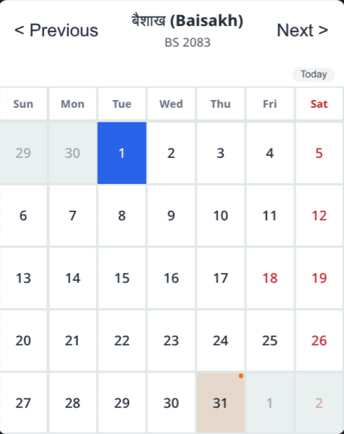
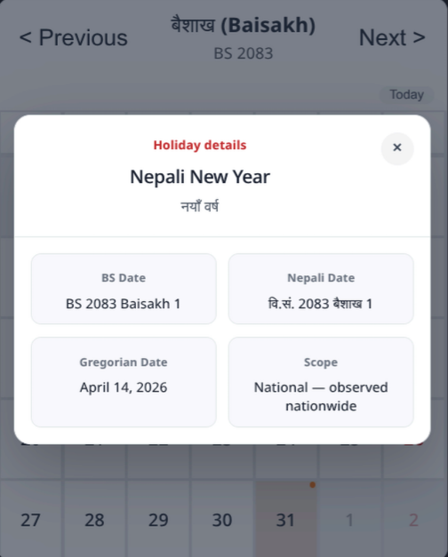

# 🇳🇵 nepali-patro

> A precise, zero-dependency **Bikram Sambat (BS)** calendar library for **React** and **React Native**.
>
> Ships with bundled BS month-length tables, public holidays, a holiday details modal, civil-date-safe conversion, graceful fallback for missing future years, and a shared-hook architecture.

---

## 📸 UI Preview

### Calendar view



### Holiday details modal



---

## ✨ Features

| Feature | Details |
|---|---|
| **Bundled BS Month Data** | Month-length tables currently cover BS 2000 → 2100 in `months.data.ts` so the library can render historical and projected years consistently |
| **Public Holidays** | Holiday tables include `nameNp` plus `scope`, so the UI can show both the holiday name and a readable audience/coverage description |
| **Holiday Details Modal** | Clicking or tapping a holiday opens a modal with the full holiday name, Nepali name, BS date, Gregorian date, scope, and any events on that day |
| **BS ↔ AD Converter** | Epoch-based conversion that normalizes to the civil date, avoiding timezone/time-of-day drift |
| **Graceful Fallback** | If a requested year is missing, the library falls back to the latest known year instead of crashing |
| **Three Entry Points** | `nepali-patro` (web), `nepali-patro/native` (React Native), `nepali-patro/core` (utilities only) |
| **Shared React Hook** | `useNepaliCalendar` drives both web and native UIs — one state layer, two render targets |
| **Custom Themes** | Override colors for Saturdays, holidays, today, selection, event dots, surfaces, borders, and header text |
| **Event Overlay** | Pass arbitrary events such as exams, birthdays, or meetings, with optional custom dot colors |
| **Tree-Shakeable** | Import only what you need; unused UI code is dropped by your bundler |

---

## 📦 Installation

```bash
npm install nepali-patro
# or
yarn add nepali-patro
# or
pnpm add nepali-patro
```

**Peer dependencies**
- `react >= 18.0.0` (required)
- `react-native >= 0.72.0` (optional — only if you use the `/native` entry)

---

## 🚀 Quick Start

### 1. React (Web)

```tsx
import { NepaliCalendar } from "nepali-patro";

function App() {
  return (
    <NepaliCalendar
      events={[
        {
          bsYear: 2083,
          bsMonth: 2,   // Jestha
          bsDay: 15,
          title: "Exam begins",
          color: "#E8751A",
        },
      ]}
      theme={{
        saturdayColor: "#C0272D",
        selectedColor: "#2563EB",
        todayColor: "#E8751A",
      }}
      onDayPress={(day) => {
        console.log("Pressed:", day.bsYear, day.bsMonth, day.bsDay);
        console.log("Holiday scope:", day.holidayScope);
        console.log("AD equivalent:", day.adDate.toISOString());
      }}
      onMonthChange={(year, month) => {
        console.log("Now viewing:", year, month);
      }}
    />
  );
}
```

Holiday cells open a centered details modal in the calendar UI. The modal shows the full holiday names, scope description, BS date, Gregorian date, and any events attached to that day.

### 2. React Native

```tsx
import { NepaliCalendar } from "nepali-patro/native";

function CalendarScreen() {
  return (
    <NepaliCalendar
      events={[
        {
          bsYear: 2083,
          bsMonth: 1,
          bsDay: 1,
          title: "Nepali New Year",
        },
      ]}
      theme={{ saturdayColor: "#C0272D" }}
      onDayPress={(day) => {
        Alert.alert(
          `${day.bsYear}-${day.bsMonth}-${day.bsDay}`,
          day.holidayName ?? "No holiday"
        );
      }}
    />
  );
}
```

> ⚠️ **Never** import `nepali-patro/native` in a web project — it depends on `react-native` primitives and will crash without the RN runtime.

### 3. Utilities Only (No UI)

Perfect for backends, CLIs, or custom UI frameworks such as Vue, Svelte, or Angular.

```ts
import {
  convertADtoBS,
  convertBStoAD,
  NepaliDate,
  getHolidays,
  generateCalendarGrid,
} from "nepali-patro/core";

// Convert Gregorian → Bikram Sambat
const bs = convertADtoBS(new Date(2026, 4, 14));
console.log(bs); // { year: 2083, month: 1, day: 31 }

// Convert BS → Gregorian
const ad = convertBStoAD(2083, 1, 31);
console.log(ad); // Date object for 2026-05-14

// Date class with formatting & arithmetic
const d = new NepaliDate(2083, 1, 15);
console.log(d.format("YYYY-MM-DD")); // "2083-01-15"
console.log(d.monthNameNp()); // "बैशाख"
console.log(d.addDays(10).toString()); // "2083-01-25"

// Holidays for a year
const holidays = getHolidays(2082);
console.log(holidays.find((h) => h.month === 1 && h.day === 1));
// { month: 1, day: 1, name: "Nepali New Year", nameNp: "नयाँ वर्ष", scope: "national" }

// Generate a raw calendar grid (weeks × 7 days)
const grid = generateCalendarGrid(2083, 1);
console.log(grid.length); // 5 or 6 weeks
```

---

## 🎨 Theming

All colors accept any valid CSS / React Native color string.

| Token | Default | Applies to |
|---|---|---|
| `saturdayColor` | `#C0272D` | Saturdays + holiday accents |
| `holidayColor` | `#C0272D` | Holiday accents and modal headings |
| `eventDotColor` | `#E8751A` | Event indicator dots without an explicit color |
| `selectedColor` | `#2563EB` | Selected day background |
| `todayColor` | `#E8751A` | Today ring / highlight |
| `textColor` | `#1F2937` | Normal day numbers |
| `headerColor` | `#1F2937` | Month/year header text |
| `surfaceColor` | `#FFFFFF` | Calendar and modal surfaces |
| `borderColor` | `#E5E7EB` | Calendar grid and modal borders |

```tsx
<NepaliCalendar
  theme={{
    saturdayColor: "#DC2626",
    selectedColor: "#7C3AED",
    todayColor: "#059669",
    surfaceColor: "#F9FAFB",
    borderColor: "#E5E7EB",
  }}
/>
```

---

## 📐 Architecture

```
┌─────────────────────────────────────────┐
│  consumer app                           │
│  import from 'nepali-patro'             │
│  or 'nepali-patro/native'               │
├─────────────────────────────────────────┤
│  web components    │  native components  │
│  div/span/CSS      │  View/Text/Style     │
│  holiday modal     │  holiday modal       │
├─────────────────────────────────────────┤
│  useNepaliCalendar (shared hook)        │
│  month nav · selected · event merge      │
├─────────────────────────────────────────┤
│  core (pure TypeScript)                 │
│  NepaliDate · converter · generator      │
├─────────────────────────────────────────┤
│  data layer (static)                    │
│  months.data.ts · holidays.data.ts      │
│  fallback.ts (graceful degrade)         │
└─────────────────────────────────────────┘
```

**Why static data instead of formulas?**
Bikram Sambat month lengths are irregular and are published year by year. The library stores the known tables in code and falls back to the latest known year when future data is missing.

---

## 🧩 API Reference

### `NepaliCalendar` Props

| Prop | Type | Default | Description |
|---|---|---|---|
| `initialYear` | `number` | Current BS year | Year to open the calendar on |
| `initialMonth` | `1 \| 2 \| … \| 12` | Current BS month | Month to open the calendar on |
| `events` | `CalendarEvent[]` | `[]` | Events to overlay |
| `theme` | `CalendarTheme` | `{}` | Color overrides |
| `onDayPress` | `(day: CalendarDay) => void` | — | Called when a day is pressed |
| `onMonthChange` | `(year, month) => void` | — | Called when month/year changes |

### `HolidayModal`

The same modal `NepaliCalendar` opens internally when a user taps a holiday cell. It is exported from both entry points so you can reuse it anywhere — for example, in a list of the month’s public holidays rendered below the calendar.

**React (Web)**

```tsx
import { HolidayModal } from "nepali-patro";
import type { CalendarDay } from "nepali-patro";

const [selectedDay, setSelectedDay] = useState<CalendarDay | null>(null);

<HolidayModal
  day={selectedDay}                   // null = hidden, CalendarDay = shown
  onClose={() => setSelectedDay(null)}
  theme={{ holidayColor: "#C0272D" }} // optional — same tokens as NepaliCalendar
/>
```

**React Native**

```tsx
import { HolidayModal } from "nepali-patro/native";
import type { CalendarDay } from "nepali-patro/native";

const [selectedDay, setSelectedDay] = useState<CalendarDay | null>(null);

<HolidayModal
  day={selectedDay}
  onClose={() => setSelectedDay(null)}
  theme={{ holidayColor: "#C0272D" }}
/>
```

> The web and native versions share identical props but render with their own platform primitives. Never import `nepali-patro/native` in a web project or vice versa.

**Props** (same for both platforms)

| Prop | Type | Required | Description |
|---|---|---|---|
| `day` | `CalendarDay \| null` | ✅ | The day to display. Pass `null` to close. |
| `onClose` | `() => void` | ✅ | Called when backdrop or × is pressed. |
| `theme` | `CalendarTheme` | — | Same theme object as `NepaliCalendar`. |

> There is **no `visible` prop**. Visibility is derived from `!!day`.
> Pass `null` to close — do not pass a separate boolean.

**Building a `CalendarDay` from a `NepaliHoliday`**

When you have a `NepaliHoliday` from `getHolidays()` and want to open the
modal from your own list, construct the `CalendarDay` manually:

```ts
import { convertBStoAD } from "nepali-patro/core";
import type { CalendarDay, NepaliHoliday } from "nepali-patro"; // or /native

function holidayToDay(h: NepaliHoliday, year: number, month: number): CalendarDay {
  const adDate = convertBStoAD(year, month, h.day);
  return {
    bsDay: h.day,
    bsMonth: month,
    bsYear: year,
    adDate,
    isSaturday: adDate.getDay() === 6,
    isHoliday: true,
    holidayName: h.name,
    holidayNameNp: h.nameNp,
    holidayScope: h.scope,
    isToday: false,
    isCurrentMonth: true,
    events: [],
  };
}
```

### `CalendarEvent`

```ts
interface CalendarEvent {
  bsYear: number;
  bsMonth: 1 | 2 | ... | 12;
  bsDay: number;
  title: string;
  color?: string; // optional dot color
}
```

### `NepaliHoliday`

```ts
interface NepaliHoliday {
  month: number;
  day: number;
  name: string;
  nameNp?: string;
  scope?: HolidayScope;
}
```

### `HolidayScope`

The holiday details modal displays a readable description for each scope.

| Scope | Meaning |
|---|---|
| `national` | Observed nationwide |
| `dashain` | Dashain festival holiday |
| `tihar` | Tihar festival holiday |
| `ethnic` | Holiday for specific ethnic communities |
| `women` | Holiday for women only |
| `education` | For educational institutions only |
| `kathmandu-valley` | Only inside Kathmandu Valley |
| `observed` | Officially observed holiday |
| `disabilities` | For people with disabilities |
| `birth-anniversary` | Commemorates a birth anniversary |
| `office-open` | Government offices remain open |

### `CalendarDay`

```ts
interface CalendarDay {
  bsDay: number;
  bsMonth: BSMonth;
  bsYear: BSYear;
  adDate: Date;              // Gregorian equivalent
  isSaturday: boolean;
  isHoliday: boolean;        // true if public holiday OR Saturday
  holidayName?: string;      // English holiday label
  holidayNameNp?: string;    // Devanagari holiday label
  holidayScope?: HolidayScope; // Holiday audience/category from the source data
  isToday: boolean;
  isCurrentMonth: boolean;   // false for padding days
  events: CalendarEvent[];
}
```

### `useNepaliCalendar` Hook

For advanced consumers who want to build a custom UI while reusing the shared calendar state.

```tsx
import { useNepaliCalendar } from "nepali-patro";

const {
  year,
  month,
  grid,          // CalendarDay[][]
  selected,
  setSelected,
  holidays,
  events,
  goNextMonth,
  goPrevMonth,
  jumpTo,
  goToday,
  isCurrentMonth,
} = useNepaliCalendar({
  initialYear: 2083,
  initialMonth: 1,
  events: myEvents,
});
```

### `NepaliDate` Class

```ts
const d = new NepaliDate(2083, 1, 15);

d.toAD();               // → Date (Gregorian)
d.format("YYYY-MM-DD"); // → "2083-01-15"
d.monthNameNp();        // → "बैशाख"
d.addDays(10);          // → new NepaliDate(...)
d.addMonths(2);         // → new NepaliDate(...)
d.isBefore(other);      // → boolean
d.equals(other);        // → boolean
NepaliDate.today();     // → NepaliDate for today
NepaliDate.fromAD(ad);  // → NepaliDate from JS Date
```

---

## 🗓️ Adding New Year Data

When the Nepal government publishes the official calendar for a new BS year:

1. **Month lengths** — open `src/data/months.data.ts` and append the year:
   ```ts
   2091: [31, 31, 32, 31, 31, 31, 30, 29, 30, 29, 30, 30],
   ```

2. **Holidays** — open `src/data/holidays.data.ts` and append the year:
   ```ts
   2091: [
     { month: 1, day: 1, name: "Nepali New Year", nameNp: "नयाँ वर्ष", scope: "national" },
     // ...rest of the official list
   ],
   ```

3. **No code changes needed** — the fallback resolver automatically picks up the new year.

4. **Open a PR** with a link to the official gazette / Nepal Calendar Determination Committee announcement.

---

## 🤝 Contributing

We welcome contributions. Typical PRs include:

- **Data updates** — new BS year tables or corrected holidays.
- **Bug fixes** — converter edge cases, UI glitches, accessibility improvements.
- **Features** — new theme tokens, additional date formatting tokens, or UI polish.

**Development setup**

```bash
git clone https://github.com/Abhishek-Gaire/nepali-patro.git
cd nepali-patro
npm install
npm run typecheck
npm run build
```

Please include tests for any core logic changes and follow the existing comment style.

---

## 📄 License

MIT © [Abhishek Gaire](https://github.com/Abhishek-Gaire)

---

## 🙏 Acknowledgements

- Month-length data sourced from official publications of the **Nepal Calendar Determination Committee** (नेपाल पञ्चाङ्ग निर्णायक समिति) and maintained year tables in the repository.
- Holiday lists based on **Government of Nepal public holiday notifications**.
